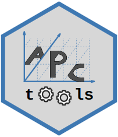

```{r options, echo=FALSE}
library(knitr)
opts_chunk$set(warning=FALSE)
```

# APCtools 

<!-- badges: start -->
[](https://travis-ci.com/bauer-alex/APCtools)
[](https://ci.appveyor.com/project/bauer-alex/APCtools)
[](https://codecov.io/gh/bauer-alex/APCtools?branch=master)
[](https://opensource.org/licenses/GPL-3.0)
<!-- badges: end -->

Routines and visualization techniques for descriptive and model-based APC analyses.

* Authors: [Alexander Bauer](https://www.en.stablab.stat.uni-muenchen.de/people/doktoranden/bauer1/index.html), [Maximilian Weigert](https://www.en.stablab.stat.uni-muenchen.de/people/doktoranden/weigert/index.html), [Hawre Jalal](https://www.publichealth.pitt.edu/home/directory/hawre-jalal)
* Contributors: Pauline Hohenemser
* Version: 1.0


## Overview

Age-Period-Cohort (APC) analyses are used to differentiate relevant drivers for
long-term developments. The `APCtools` package offers visualization techniques
and general routines to simplify the workflow of an APC analysis. Sophisticated
functions are available both for descriptive and regression model-based analyses.
For the former, we use density (or ridgeline) matrices and (hexagonally binned)
heatmaps as innovative visualization techniques building on the concept of Lexis
diagrams. Model-based analyses build on the separation of the temporal dimensions
based on generalized additive models, where a tensor product interaction surface
(usually between age and period) is utilized to represent the third dimension
(usually cohort) on its diagonal. Such tensor product surfaces can also be
estimated while accounting for further covariates in the regression model.

Useful materials:

* To get an overview of the functionalities of the package, check out the
package vignette by running
    
```r
devtools::install_github("bauer-alex/APCtools", build_vignettes = TRUE)
vignette("main_functionality", package = "APCtools")
```

* See [Weigert et al. (2021)](https://doi.org/10.1177/1354816620987198) or
our corresponding [research poster](https://www.researchgate.net/publication/353852226_Visualization_techniques_for_semiparametric_APC_analysis_Using_Generalized_Additive_Models_to_examine_touristic_travel_distances)
for methodological details.
    
* The *hexamaps* are outlined in
[Jalal & Burke (2020)](https://doi.org/10.1097/EDE.0000000000001236).


## Installation

The most current version from GitHub can be installed via
```{r, eval=FALSE}
devtools::install_github("bauer-alex/APCtools")
```


## Getting help

Please open a [GitHub issue](https://github.com/bauer-alex/APCtools/issues)
if you encounter a bug or have suggestions for additional functionalities of
the package.
Alternatively, feel free to contact us directly via email (see author list above).


## References

Weigert, M., Bauer, A., Gernert, J., Karl, M., Nalmpatian, A., Küchenhoff, H.,
and Schmude, J. (2021). Semiparametric APC analysis of destination choice
patterns: Using generalized additive models to quantify the impact of age,
period, and cohort on travel distances. *Tourism Economics*.
https://doi.org/10.1177/1354816620987198.

Jalal, H., Burke, D. (2020). Hexamaps for Age–Period–Cohort Data Visualization
and Implementation in R. *Epidemiology*, 31 (6), e47-e49. doi: https://doi.org/10.1097/EDE.0000000000001236.
