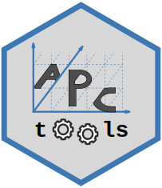

# APCtools 

<!-- badges: start -->

<!-- badges: end -->

Routines and visualization techniques for descriptive and model-based
APC analyses.

-   Authors: [Alexander
    Bauer](https://www.en.stablab.stat.uni-muenchen.de/people/doktoranden/bauer1/index.html),
    [Maximilian
    Weigert](https://www.en.stablab.stat.uni-muenchen.de/people/doktoranden/weigert/index.html),
    [Hawre
    Jalal](https://www.publichealth.pitt.edu/home/directory/hawre-jalal),
    Pauline Hohenemser
-   Version: 1.0

## Overview

TODO
