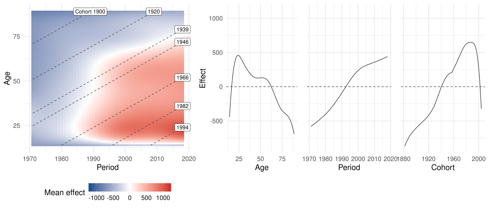

# Summary

Age-Period-Cohort (APC) analysis aims to determine relevant drivers for
long-term developments and is used in many fields of science [@yang_land_2013].
The R package `APCtools` offers modern visualization techniques and general
routines to facilitate the interpretability of the interdependent temporal
structures and to simplify the workflow of an APC analysis.
Separation of the temporal effects is performed utilizing a semiparametric
regression approach. We shortly discuss the challenges of APC analysis, give an overview of existing
statistical software packages and outline the main functionalities of the package.

# Statement of Need

The main focus in APC analysis is on disentangling the interconnected effects
of age, period, and cohort.
Long-term developments of some characteristic can either be associated
with changes in a person's life cycle (age), macro-level developments over the years
that simultaneously affect all age groups (period), or the generational
membership of an individual, shaped by similar socialization processes and historical experiences
(cohort).

The critical challenge in APC analysis is the linear dependency of the
components age, period, and cohort (cohort = period - age). Flexible methods and visualization techniques are needed to circumvent this *identification problem*.
Several packages for APC analysis exist for the statistical software R.
Package `apc` [@R_apc] implements methods based on the canonical parametrization
of @kuang_2008, which however lack flexibility and
robustness when compared to nonlinear regression approaches.
Package `bamp` [@schmid_held_2007] offers routines for the analysis of incidence and mortality
data based on a Bayesian APC model with a nonlinear prior.
R package `Epi` [@R_Epi] implements the methods introduced in @carstensen_2007
to analyze disease and mortality rates, including the estimation of separate
smooth effects for age, period and cohort.
@rosenberg_2014 developed an R-based web tool for the analysis of cancer rates,
including different estimates for marginal effect curves.

In contrast to the above software packages, `APCtools` builds on a flexible and robust
semiparametric regression approach.
The package includes modern visualization techniques and general routines to facilitate
the interpretability of the estimated temporal structures and to simplify the workflow
of an APC analysis.
As is outlined below in further detail,
sophisticated functions are available both for descriptive and regression model-based analyses.
For the former, we use density (or ridgeline) matrices, classical heatmaps and
*hexamaps* (hexagonally binned heatmaps) as innovative visualization techniques
building on the concept of Lexis diagrams.
Model-based analyses build on the separation of the temporal dimensions
based on generalized additive models, where a tensor product interaction surface
(usually between age and period) is utilized to represent the third dimension
(usually cohort) on its diagonal. Such tensor product surfaces can also be
estimated while accounting for further covariates in the regression model.

# Descriptive Analysis

In the following, we showcase the main functionalities of the `APCtools` package
on the included `travel` dataset, containing data from the German *Reiseanalyse* survey --
a repeated cross-sectional study comprising information on German travelers between
1971 and 2018.
Focus is on travelers between 14 and 89 years and the distance of each traveler's
_main trip_ -- i.e. each traveler's
most important trip in the respective year -- and how these distances change over the
temporal dimensions.

Several descriptive visualization techniques are implemented that are all based on
the classical concept of Lexis diagrams where two temporal dimensions (of
age, period, and cohort) are depicted on the x- and y-axis, and the remaining
dimension along the diagonals.
Additional to heatmaps and _hexamaps_ (see below) this includes density matrices
(called _ridgeline matrices_ in @weigert_2021) which can be used to flexibly
visualize observed distributions along the temporal dimensions.
Such visualizations can for example be used to illustrate changes in travel distances.
As can be seen in \autoref{fig:descriptive} and \autoref{fig:hexamaps},
longer-distance travels are mainly undertaken by young age groups and in more recent years.

{width=60%}

# Model-based Analysis

To properly estimate the association of a process with the individual dimensions age, period,
and cohort, we utilize the approach introduced by @clements_2005 who circumvent the
identification problem by representing the effect of one temporal dimension (e.g. cohort)
based on a nonlinear interaction surface between the other two dimensions
(age and period).
This leads to a generalized additive regression model (GAM, @wood_2017) of the
following form:
$$
g(\mu_i) = \beta_0 + f_{ap}(age_i, period_i) + \eta_i, \ \ \ \ \ i=1,\ldots,n,
$$
with observation index $i$, $\mu_i$ the expected value of an exponential family
response, link function $g(\cdot)$ and the intercept $\beta_0$.
The interaction surface is included as a tensor product surface $f_{ap}(age_i, period_i)$,
represented by a two-dimensional spline basis.
$\eta_i$ represents an optional linear predictor that contains further covariates.
Model estimation can be performed with functions `gam` or `bam` from R package
`mgcv` [@wood_2017].
As outlined in @weigert_2021 this modeling approach can both be applied to repeated
cross-sectional data and panel data.

Based on an estimated GAM, a heatmap of the smooth tensor product surface
can be plotted (see \autoref{fig:modelEffects}). Additionally, marginal
effects of the individual temporal dimensions can be extracted by averaging over
each dimension.

As an alternative to classical heatmaps the raw observed APC structures or
the subsequently estimated model-based tensor product surface can also be
visualized using _hexamaps_, i.e. hexagonally
binned heatmaps where developments over age, period, and cohort are given
equal visual weight by distorting the coordinate system [@jalal_2020].
This resolves the central problem of classical heatmaps where developments over
the diagonal dimension are visually underrepresented compared to developments
over the dimensions depicted on the x- and y-axis.

`APCtools` further provides partial APC plots, which can be used to visualize
interdependencies between the different temporal dimensions (see @weigert_2021
for details). Also, several utility functions are available to plot covariate
effects as well as functions to create publication-ready
summary tables of the central model results.

# Acknowledgments

We thank Helmut Küchenhoff for valuable methodological contributions.
This work has been partially funded by the German Research Foundation (DFG) under Grant No.
KU 1359/4-1 and by the German Federal Ministry of Education and
Research (BMBF) under Grant No. 01IS18036A.

# References
