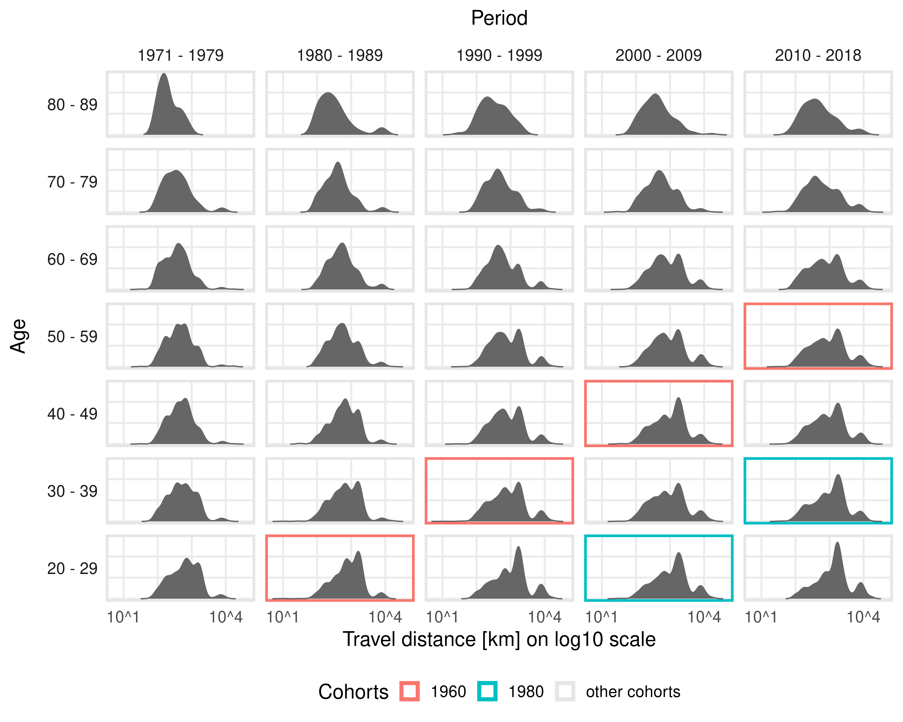
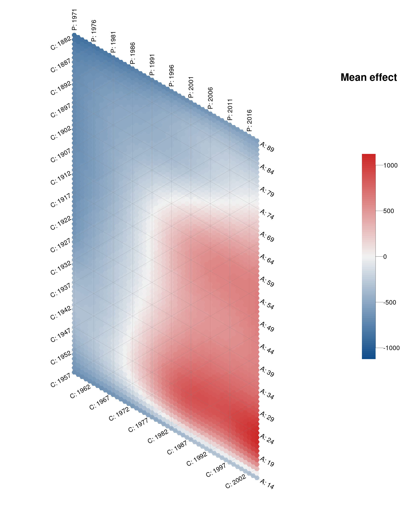

# Introduction

Age-Period-Cohort (APC) analysis aims to determine relevant drivers for
long-term developments and is used in many fields of science [@yang_land_2013].
The main focus is on disentangling the interconnected effects of age, period, and
cohort.
Long-term developments of an individual's characteristics can either be associated
with changes in a person's lifecycle (age), macro-level developments over the years
that simultaneously affect all age groups (period), and the generational
membership, shaped by similar socialization processes and historical experiences
(cohort).

The critical challenge in APC analysis is that the main components age, period,
and cohort are linearly dependent (cohort = period - age).
Accordingly, flexible methods and visualization techniques are needed to properly
disentangle observed temporal association structures.
To this day, no packages for the statistical software R exist that cover all
relevant aspects of APC analysis with state-of-the-art methods for visualization
and modeling.
The only relevant R package `apc` [@R_apc] implements specific generalized linear
model and ordinary least squares approaches, which however are less flexible
and harder to interpret compared to the semiparametric regression approach outlined
below.
`APCtools` is the first comprehensive R package for APC analysis.
It includes modern visualization techniques and routines to facilitate the
interpretability of sophisticated statistical models.
Special focus is on enabling practical researchers to apply all methods
and properly interpret the resulting temporal interdependencies.
All methods are outlined in @weigert_2021 and @jalal_2020.

In the following, we showcase the main functionalities of the `APCtools` package
based on the included `travel` dataset, containing data from the German Reiseanalyse survey --
a repeated cross-sectional study comprising information on German travelers between
1971 and 2018.
Focus is on the distances of each traveler's _main trip_ -- i.e. each traveler's
most important trip in the respective year -- and how these distances change over the
temporal dimensions.

# Descriptive Visualizations

Several descriptive visualization techniques are implemented that are all based on
the classical concept of Lexis diagrams where two temporal dimensions (of
age, period, and cohort) are depicted on the x- and y-axis, and the remaining
dimension is depicted along the diagonals.
Additional to heatmaps and _hexamaps_ (see below) this includes density matrices
(called _ridgeline matrices_ in @weigert_2021) which can be used to flexibly
visualize observed distributions along the temporal dimensions.
A distance matrix can for example be used to visualize changes in travel distances.
As can be seen in \autoref{fig:descriptive}, longer-distance travels are mainly
undertaken by young age groups and in more recent years.

{width=50%}

# Model-based Analysis

To properly estimate and disentangle the association of a process with age, period,
and cohort, we utilize the approach introduced by @clements_2005 who solve the
identification problem by representing the effect of one temporal dimension (e.g. cohort)
based on a nonlinear interaction surface between the other two dimensions
(age and period).
This leads to a generalized additive regression model (GAM, @wood_2017) of the
following form:
$$
g(\mu_i) = \beta_0 + f_{ap}(age_i, period_i) + \eta, \ \ \ \ \ i=1,\ldots,n,
$$
with observation index $i$, $\mu_i$ the expected value of an exponential family
response, link function $g(\cdot)$ and the intercept $\beta_0$.
The interaction surface is included as a tensor product surface $f_{ap}(age_i, period_i)$,
represented by a two-dimensional spline basis.
$\eta$ represents an optional linear predictor that contains further control variables.
Model estimation can be performed with functions `gam` or `bam` from R package
`mgcv` [@wood_2017].
As outlined in @weigert_2021 this modeling approach can both be applied to repeated
cross-sectional data and panel data.

Based on an estimated GAM, a heatmap of the smooth tensor product surface
can be plotted (see \autoref{fig:modelEffects}). Additionally, marginal
effects of the individual temporal dimensions can be extracted by averaging over
each dimension.

As an alternative to classical heatmaps the raw observed APC structures or
the subsequently estimated model-based tensor product surface can also be
visualized using _hexamaps_, i.e. hexagonally
binned heatmaps where developments over age, period, and cohort are given
equal visual weight by distorting the coordinate system [@jalal_2020].
This resolves the central problem of classical heatmaps where developments over
the diagonal dimension are visually underrepresented compared to developments
over the dimensions depicted on the x- and y-axis.

`APCtools` further implements partial APC plots, which can be used to visualize
the interdependencies between the different temporal dimensions (see @weigert_2021
for details). Also, several utility functions are available to plot covariate
effects estimated in the model, as well as functions to create publication-ready
summary tables of the central model results.

# Acknowledgments

We thank Helmut Küchenhoff for valuable methodological contributions.

# References
